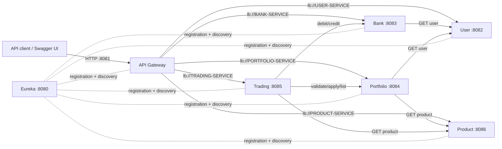
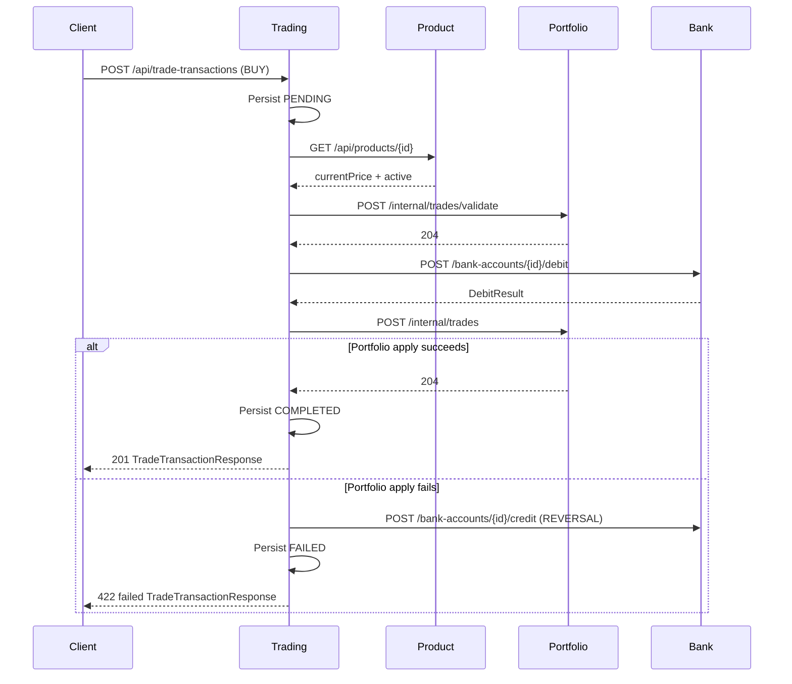

# WealthTrack Microservice API Map

This document maps every custom controller outside `MAIN`, the REST contracts consumed
between services, and the runtime dependencies visible in source code. The executable
OpenAPI 3.0.3 contract is in [`openapi.yaml`](./openapi.yaml).

## Scope and important contract notes

- Reviewed applications: Eureka Server, API Gateway, User, Bank, Portfolio, Trading,
  and Product.
- `MAIN` is intentionally excluded.
- The repository contains **69 custom controller operations**: Gateway 5, User 20,
  Bank 13, Portfolio 14, Product 10, and Trading 7.
- Eureka has no repository-defined controller. Its dashboard and `/eureka/**`
  registration/discovery protocol are supplied by Netflix Eureka libraries; their full
  framework schema cannot be derived from this repository without inventing a contract,
  so they are not represented as business operations in `openapi.yaml`.
- No service currently configures Spring Security or an equivalent authentication or
  authorization layer. All business and `internal` endpoints are unauthenticated.
- Inter-service calls are synchronous REST over Spring Cloud OpenFeign and are resolved
  by Eureka service name. No gRPC, message broker, or application event integration is
  implemented.

## Architecture



## Service catalog

| Microservice | Default port | Eureka name | Responsibility | APIs consumed |
|---|---:|---|---|---|
| Eureka Server | 8080 | `WTMS-EUREKA-SERVER` | Service registry and discovery infrastructure | None |
| API Gateway | 8081 | `WTMS-GATEWAY` | Prefix routing, load balancing, circuit breakers, plain-text fallbacks | All five business services through `lb://` routes |
| User Service | 8082 | `USER-SERVICE` | Roles, users, reporting relationships, risk/KYC profile data | None |
| Bank Service | 8083 | `BANK-SERVICE` | Bank accounts, balances, debit/credit commands, KYC document metadata | User Service |
| Portfolio Service | 8084 | `PORTFOLIO-SERVICE` | Portfolio accounts, holdings, valuation, and trade application | User Service, Product Service |
| Trading Service | 8085 | `TRADING-SERVICE` | BUY/SELL orchestration, compensation, statements, investment overview | Product, Portfolio, and Bank Services |
| Product Service | 8086 | `PRODUCT-SERVICE` | Product types, investable product catalog, price and active state | None |

## APIs exposed

All JSON body operations use `Content-Type: application/json`. There are no custom
request headers. `Auth` is `None` for every row because the current code has no
authentication or authorization.

### API Gateway

Gateway route prefixes are removed before forwarding:

| External prefix | Target | Fallback |
|---|---|---|
| `/user/**` | `lb://USER-SERVICE` | `GET /userFallback` |
| `/bank/**` | `lb://BANK-SERVICE` | `GET /bankFallback` |
| `/portfolio/**` | `lb://PORTFOLIO-SERVICE` | `GET /portfolioFallback` |
| `/trading/**` | `lb://TRADING-SERVICE` | `GET /tradingFallback` |
| `/product/**` | `lb://PRODUCT-SERVICE` | `GET /productFallback` |

| Method | Path | Purpose | Success | Auth |
|---|---|---|---|---|
| GET | `/userFallback` | Plain-text User Service timeout/circuit-breaker fallback | 200 text | None |
| GET | `/bankFallback` | Plain-text Bank Service fallback | 200 text | None |
| GET | `/portfolioFallback` | Plain-text Portfolio Service fallback | 200 text | None |
| GET | `/tradingFallback` | Plain-text Trading Service fallback | 200 text | None |
| GET | `/productFallback` | Plain-text Product Service fallback | 200 text | None |

Gateway `GATEWAY_TIMEOUT_DURATION` defaults to 5 seconds. No gateway retry filter is
configured. A fallback controller currently returns HTTP 200, so clients must not treat
the status alone as proof that the downstream operation succeeded.

### User Service

| Method | Path | Purpose | Success | Auth |
|---|---|---|---|---|
| POST | `/api/roles` | Create a uniquely named role | 201 `RoleResponse` | None |
| GET | `/api/roles` | List roles | 200 array | None |
| GET | `/api/roles/{id}` | Get role by ID | 200 / 404 | None |
| GET | `/api/roles/name/{roleName}` | Get role by name | 200 / 404 | None |
| PUT | `/api/roles/{id}` | Replace role name | 200 | None |
| DELETE | `/api/roles/{id}` | Delete only when unused by users | 204 | None |
| POST | `/api/users` | Create a user for an existing role/optional manager | 201 `UserResponse` | None |
| GET | `/api/users` | List users | 200 array | None |
| GET | `/api/users/{id}` | Get user; consumed by Bank and Portfolio validation | 200 / 404 | None |
| GET | `/api/users/email/{email}` | Get user by unique email | 200 / 404 | None |
| GET | `/api/users/role/{roleId}` | List users assigned to a role | 200 array | None |
| GET | `/api/users/manager/{managerId}` | List direct subordinates | 200 array | None |
| PUT | `/api/users/{id}` | Replace user fields and relationships | 200 | None |
| DELETE | `/api/users/{id}` | Delete only when no subordinates exist | 204 | None |
| POST | `/api/user-details` | Create one risk/KYC profile per user | 201 `UserDetailResponse` | None |
| GET | `/api/user-details` | List user profiles | 200 array | None |
| GET | `/api/user-details/{id}` | Get profile by profile ID | 200 / 404 | None |
| GET | `/api/user-details/user/{userId}` | Get profile by user ID | 200 / 404 | None |
| PUT | `/api/user-details/{id}` | Replace a profile | 200 | None |
| DELETE | `/api/user-details/{id}` | Permanently delete a profile | 204 | None |

User status defaults to `ACTIVE`. User responses intentionally omit `passwordHash`.
Duplicate email/role names and protected deletes are mapped to 400, not 409.

### Bank Service

| Method | Path | Purpose | Success | Auth |
|---|---|---|---|---|
| POST | `/api/bank-accounts` | Validate ACTIVE user and register account | 201 `BankAccountResponse` | None |
| GET | `/api/bank-accounts` | Filter by `userId`, `status`, `primary` | 200 array | None |
| GET | `/api/bank-accounts/{id}` | Get masked account and balance | 200 / 404 | None |
| PUT | `/api/bank-accounts/{id}` | Update mutable account metadata/status | 200 | None |
| PATCH | `/api/bank-accounts/{id}/primary` | Make an ACTIVE account primary | 200 | None |
| POST | `/api/bank-accounts/{id}/debit` | Lock and debit account | 200 `DebitResult` | None |
| POST | `/api/bank-accounts/{id}/credit` | Lock and credit account | 200 `CreditResult` | None |
| DELETE | `/api/bank-accounts/{id}` | Soft-close account | 204 | None |
| POST | `/api/kyc-documents` | Validate ACTIVE user and create KYC metadata | 201 `KycDocumentResponse` | None |
| GET | `/api/kyc-documents` | Filter by `userId`, `verificationStatus`, `documentType` | 200 array | None |
| GET | `/api/kyc-documents/{id}` | Get masked KYC document metadata | 200 / 404 | None |
| PUT | `/api/kyc-documents/{id}/verification` | Set PENDING/VERIFIED/REJECTED | 200 | None |
| DELETE | `/api/kyc-documents/{id}` | Soft-deactivate KYC metadata | 204 | None |

Debit and credit business rejection uses HTTP 200 with a false result flag. Transaction
references are echoed but not persisted, checked for uniqueness, or used for
idempotency. Account numbers and document numbers are masked in responses.

### Portfolio Service

| Method | Path | Purpose | Success | Auth |
|---|---|---|---|---|
| GET | `/` | Plain-text application liveness message | 200 text | None |
| POST | `/api/portfolios` | Validate ACTIVE user and open one portfolio | 201 `PortfolioAccountResponse` | None |
| GET | `/api/portfolios` | List portfolio accounts | 200 array | None |
| GET | `/api/portfolios/{portfolioAccountId}` | Get portfolio account | 200 / 404 | None |
| GET | `/api/portfolios/by-user/{userId}` | Get portfolio by user; consumed by Trading | 200 / 404 | None |
| PATCH | `/api/portfolios/{portfolioAccountId}/status` | Change ACTIVE/SUSPENDED/CLOSED state | 200 | None |
| POST | `/api/portfolios/{portfolioAccountId}/holdings` | Validate Product and add/increase holding | 201 `PortfolioHoldingResponse` | None |
| GET | `/api/portfolios/{portfolioAccountId}/holdings` | List holdings, optional `status` | 200 array | None |
| GET | `/api/portfolios/holdings/{holdingId}` | Get holding | 200 / 404 | None |
| PATCH | `/api/portfolios/holdings/{holdingId}` | Partially update holding | 200 | None |
| DELETE | `/api/portfolios/holdings/{holdingId}` | Delete empty or CLOSED holding | 204 | None |
| POST | `/api/portfolios/internal/trades/validate` | Validate Trading command before money moves | 204 | None |
| POST | `/api/portfolios/internal/trades` | Apply funded BUY/SELL to holding | 204 | None |
| GET | `/api/portfolios/{portfolioAccountId}/summary` | Return account, holdings, cost/value/P&L | 200 `PortfolioSummaryResponse` | None |

The summary uses stored holding `marketValue`; it does not refresh quotes. The internal
trade apply endpoint validates `transactionId` but does not persist/deduplicate it, so a
duplicate call can apply the same quantity twice.

### Product Service

| Method | Path | Purpose | Success | Auth |
|---|---|---|---|---|
| POST | `/api/product-types` | Create unique normalized product type | 201 `ProductTypeResponse` | None |
| GET | `/api/product-types` | Filter by `status`, exact `typeName` | 200 array | None |
| GET | `/api/product-types/{id}` | Get product type | 200 / 404 | None |
| PUT | `/api/product-types/{id}` | Replace product type | 200 | None |
| DELETE | `/api/product-types/{id}` | Delete only when unused by products | 204 | None |
| POST | `/api/products` | Create uniquely named investment product | 201 `InvestmentProductResponse` | None |
| GET | `/api/products` | Filter by type/status/risk/price method/name | 200 array | None |
| GET | `/api/products/{id}` | Get quote/catalog record; consumed by Portfolio/Trading | 200 / 404 | None |
| PUT | `/api/products/{id}` | Replace investment product | 200 | None |
| DELETE | `/api/products/{id}` | Permanently delete product | 204 | None |

Product status defaults to ACTIVE. Maturity cannot precede issue date. The service does
not query Portfolio or Trading before deleting a product.

### Trading Service

| Method | Path | Purpose | Success | Auth |
|---|---|---|---|---|
| POST | `/api/trade-transactions` | Execute synchronous BUY/SELL saga | 201 completed / 422 failed trade | None |
| GET | `/api/trade-transactions` | Filter by portfolio/status/type/date-time range | 200 array | None |
| GET | `/api/trade-transactions/{id}` | Get stored trade | 200 / 404 | None |
| POST | `/api/portfolio-statements/internal` | Create GENERATED statement from supplied values and stored trades | 201 | None |
| GET | `/api/portfolio-statements` | Filter statements by portfolio/status/date range | 200 array | None |
| GET | `/api/portfolio-statements/{id}` | Get statement and transaction IDs | 200 / 404 | None |
| GET | `/api/investment-overview/users/{userId}` | Aggregate Portfolio holdings, completed trades, and Product prices | 200 | None |

Trading replaces the submitted `unitPrice` with Product Service `currentPrice`. An
execution failure is persisted as `FAILED` and returned as HTTP 422 with
`TradeTransactionResponse`, not the shared error schema. `failureReason` exists only in
that immediate response and is not persisted, so later GETs return it as null.

## Inter-service communication contracts

All rows below are synchronous REST through OpenFeign unless stated otherwise.
Service names are resolved through Eureka. No call adds authentication headers.

| Caller | Target | API/event | Request projection | Response projection | Timeout | Retry |
|---|---|---|---|---|---|---|
| Gateway | User | Any `/user/**`, prefix stripped | Original HTTP request | Original response or text fallback | 5s time limiter | None configured |
| Gateway | Bank | Any `/bank/**`, prefix stripped | Original HTTP request | Original response or text fallback | 5s | None configured |
| Gateway | Portfolio | Any `/portfolio/**`, prefix stripped | Original HTTP request | Original response or text fallback | 5s | None configured |
| Gateway | Trading | Any `/trading/**`, prefix stripped | Original HTTP request | Original response or text fallback | 5s | None configured |
| Gateway | Product | Any `/product/**`, prefix stripped | Original HTTP request | Original response or text fallback | 5s | None configured |
| Bank | User | `GET /api/users/{userId}` | Path `userId` | Projection `{userId, status}` from `UserResponse` | connect 3000ms; read 10000ms | None configured |
| Portfolio | User | `GET /api/users/{id}` | Path user ID | Projection `{userId, status}` | connect 3000ms; read 10000ms | None configured |
| Portfolio | Product | `GET /api/products/{id}` | Path product ID | Projection `{productId, status}` | connect 3000ms; read 10000ms | None configured |
| Trading | Product | `GET /api/products/{productId}` | Path product ID | Projection `{productId, productName, currentPrice, active}` | connect 3000ms; read 10000ms | None configured |
| Trading | Portfolio | `POST /api/portfolios/internal/trades/validate` | `ApplyTradeRequest`-compatible command | 204/no body | connect 3000ms; read 10000ms | None configured |
| Trading | Portfolio | `POST /api/portfolios/internal/trades` | Same trade command | 204/no body | connect 3000ms; read 10000ms | None configured |
| Trading | Portfolio | `GET /api/portfolios/by-user/{userId}` | Path user ID | Projection `{portfolioAccountId, userId}` | connect 3000ms; read 10000ms | None configured |
| Trading | Portfolio | `GET /api/portfolios/{portfolioAccountId}/holdings` | Path portfolio ID | Array projection `{holdingId, portfolioAccountId, productId, quantity, averageCost, marketValue}` | connect 3000ms; read 10000ms | None configured |
| Trading | Bank | `POST /api/bank-accounts/{bankAccountId}/debit` | `{amount, transactionReference}` | `{approved, reference, failureReason}` | connect 3000ms; read 10000ms | None configured |
| Trading | Bank | `POST /api/bank-accounts/{bankAccountId}/credit` | `{amount, transactionReference}` | `{successful, reference, failureReason}` | connect 3000ms; read 10000ms | None configured |
| All clients | Eureka | Eureka registration/registry fetch | Framework-defined Eureka payload | Framework-defined registry | Not explicitly configured in project | Framework behavior; no project retry policy |

Feign environment overrides:

- Bank: `BANK_FEIGN_CONNECT_TIMEOUT_MS`, `BANK_FEIGN_READ_TIMEOUT_MS`
- Portfolio: `PORTFOLIO_FEIGN_CONNECT_TIMEOUT_MS`,
  `PORTFOLIO_FEIGN_READ_TIMEOUT_MS`
- Trading: `TRADING_FEIGN_CONNECT_TIMEOUT_MS`, `TRADING_FEIGN_READ_TIMEOUT_MS`

No service-specific retryer, circuit breaker, backoff, idempotency key, trace/correlation
header, or service-to-service credential is configured.

## Main communication flows

### Account and holding setup

1. Bank `POST /api/bank-accounts` calls User `GET /api/users/{id}` and accepts only an
   existing ACTIVE user.
2. Portfolio `POST /api/portfolios` performs the same User check.
3. Portfolio `POST /api/portfolios/{id}/holdings` calls Product
   `GET /api/products/{id}` and accepts only an existing ACTIVE product.

### BUY trade



### SELL trade

1. Trading persists PENDING, obtains Product current price, and asks Portfolio to
   validate.
2. Trading applies SELL to Portfolio.
3. Trading credits Bank.
4. If credit fails, Trading sends the opposite BUY command to Portfolio as
   compensation.
5. Success returns 201/COMPLETED; caught failure returns 422/FAILED.

### Investment overview

Trading fetches the user's Portfolio account and holdings, selects completed trades from
its own database, fetches each represented Product quote, and computes derived
positions. It does not call User Service or Bank Service for this view.

## Dependency and integration findings

### Circular dependencies

No circular **service-call** dependency exists. The business call graph is acyclic:

`Trading -> Portfolio -> (User, Product)` and
`Trading -> Bank -> User`, with Trading also calling Product directly.

Gateway-to-service routing and service-to-Eureka registration are infrastructure links,
not reverse business calls.

### Exposed or undocumented integrations

- Both Portfolio `/internal/trades*` endpoints and Trading
  `/portfolio-statements/internal` are routable and unauthenticated. “Internal” is only
  a path convention.
- No code in another microservice consumes the statement creation endpoint. Its caller
  is therefore not determinable from this repository.
- Local defaults point all persistence services at the same MySQL database (`mydb`).
  This is an implicit shared-database integration, not an API. Cross-domain foreign keys
  and locks can couple runtime behavior even though repositories remain service-local.
- Trade and Bank command references are not idempotency controls. Retrying after a
  timeout can duplicate money or holding changes.
- Gateway fallback responses use HTTP 200 plain text, losing the downstream status/body.
- Product deletion does not perform a Portfolio/Trading API check.
- Portfolio summary values are stored valuations, while Trading overview refreshes
  current prices from Product Service; the two views can legitimately differ.

## Reusable request templates

Set one direct base URL:

```bash
USER_URL=http://localhost:8082
BANK_URL=http://localhost:8083
PORTFOLIO_URL=http://localhost:8084
TRADING_URL=http://localhost:8085
PRODUCT_URL=http://localhost:8086
```

Or use `http://localhost:8081/{user|bank|portfolio|trading|product}` as the base.

### GET

```bash
curl -X GET "$PRODUCT_URL/api/products/1" \
  -H "Accept: application/json"
```

### POST

```bash
curl -X POST "$TRADING_URL/api/trade-transactions" \
  -H "Accept: application/json" \
  -H "Content-Type: application/json" \
  -d '{
    "portfolioAccountId": 1,
    "holdingId": 1,
    "productId": 1,
    "bankAccountId": 1,
    "transactionType": "BUY",
    "quantity": 1.00,
    "unitPrice": 1450.00
  }'
```

### PUT

```bash
curl -X PUT "$BANK_URL/api/bank-accounts/1" \
  -H "Accept: application/json" \
  -H "Content-Type: application/json" \
  -d '{
    "bankName": "HDFC Bank",
    "branchName": "Bandra Kurla Complex",
    "accountType": "SAVINGS",
    "ifscCode": "HDFC0004321",
    "status": "ACTIVE"
  }'
```

### PATCH

```bash
curl -X PATCH "$PORTFOLIO_URL/api/portfolios/1/status" \
  -H "Accept: application/json" \
  -H "Content-Type: application/json" \
  -d '{"accountStatus":"SUSPENDED"}'
```

### DELETE

```bash
curl -i -X DELETE "$PRODUCT_URL/api/products/1" \
  -H "Accept: application/json"
```

A successful delete/soft-delete returns `204 No Content`.

## Swagger Editor / Swagger UI

1. Import the root `openapi.yaml`.
2. For an operation, select either its direct microservice server or gateway server.
   Operation-level server entries include the required gateway prefix.
3. Start Eureka first, then the target service; start the Gateway when testing a gateway
   server entry.
4. No authorization credential is currently required or accepted.
5. Configure database and Eureka environment variables as documented in the root
   `README.md` and each service's `.env.example`.

The shared 400/401/403/404/409/422/500 response components are reusable templates.
401/403 are deliberately labeled as inactive until security is actually implemented.
