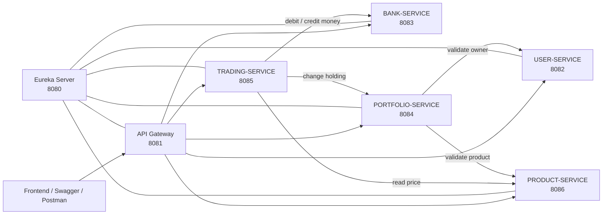
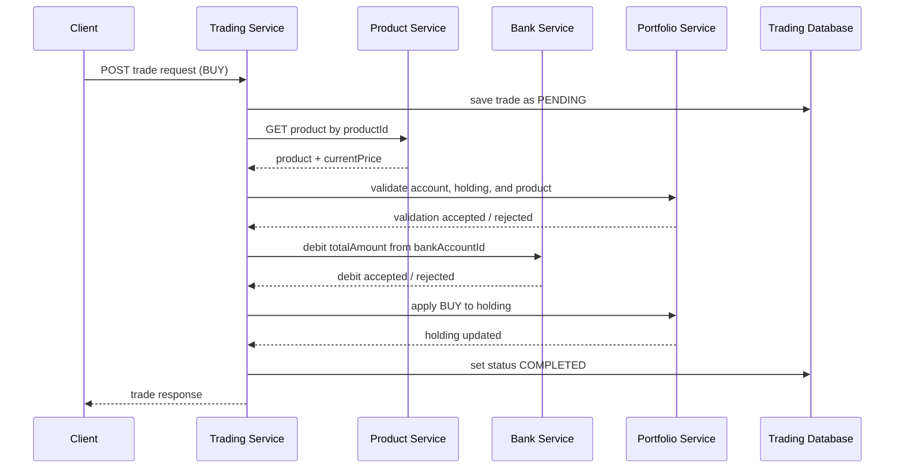
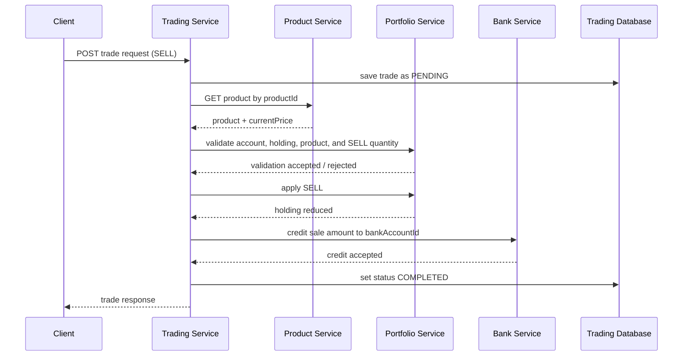

# WealthTrack Microservices

WealthTrack is a Spring Boot backend for an investment platform inspired by products such as Zerodha. A user can maintain a profile, bank account, investment portfolio, products, trade history, portfolio statements, and an investment summary.

This document describes the code that is implemented today, how the services communicate, how to run/test it, and the parts that are deliberately still future work. The `MAIN` folder is the older monolith/reference project. New development happens in the individual microservice folders.

## 1. What is implemented now?

The project is split into independently runnable services. Each service has its own Maven project, Spring Boot application, configuration, database access layer, controllers, services, repositories, and local `.env` file.

| Component | Port | Current responsibility | Status |
|---|---:|---|---|
| Eureka Server | 8080 | Registers services and lets them find one another by name. | Implemented |
| API Gateway | 8081 | Single public entry point; forwards requests to the right service. | Implemented |
| User Service | 8082 | Roles, users, and user details. | Implemented |
| Bank Service | 8083 | Bank accounts, KYC metadata, balance debit, and balance credit. | Implemented |
| Portfolio Service | 8084 | Portfolio accounts, holdings, current quantity, average cost, and holding value. | Implemented |
| Trading Service | 8085 | Buy/sell trade records, trade orchestration, portfolio statements, and investment overview. | Implemented |
| Product Service | 8086 | Product types, investment products, and their current price. | Implemented |

The key working business scenario is a stock/product buy or sell submitted to Trading Service. Trading validates the product and portfolio first, moves money through Bank Service, changes the holding through Portfolio Service, and stores the final trade record.

## 2. Architecture at a glance



### Why Eureka is needed

Eureka is a service directory. When an application starts, it registers under a name such as `TRADING-SERVICE` or `PRODUCT-SERVICE`. Trading can then call `http://PRODUCT-SERVICE/...`; Spring’s load balancer asks Eureka where that service is running and sends the request there. This avoids hardcoding `localhost:8086` into Trading.

Eureka does **not** contain business logic or database tables for users/products/trades. It only tracks available service instances.

## 3. Repository structure

```text
C:\oracle\OracleTraning\
├── eurekaServer\eurekaserver\
├── APIGateway\apigateway\
├── userMicroService\usermicroservice\
├── bankMicroService\bankmicroservice\
├── portfolioMicroService\portfoliomicroservice\
├── tradingMicroService\tradingmicroservice\
├── productMicroService\productmicroservice\
└── MAIN\                              legacy/reference monolith
```

Within a Spring Boot service, the usual responsibility is:

| Package/layer | What belongs there | Example |
|---|---|---|
| `controllers` | HTTP routes, request validation, HTTP status codes. | `POST /api/trade-transactions` |
| `dto` | Safe request/response objects used by APIs. | `CreateTradeTransactionRequest` |
| `services` | Business rules and workflow coordination. | calculate amount, call Bank/Portfolio |
| `repositories` | Database queries through Spring Data JPA. | find a trade by ID |
| `entities` | Java mapping of the existing database tables. | `TradeTransaction` |
| `clients` | Feign contracts for HTTP calls to another microservice. | `BankServiceClient` |
| `exceptions` | Domain exceptions and consistent API error responses. | trade not found -> HTTP 404 |
| `config` | Spring beans and technical configuration. | Feign timeout configuration |

An entity describes how a table is stored. A DTO describes what an API receives or returns. Keeping them separate prevents a JSON response from exposing JPA lazy-loading details or unrelated columns.

## 4. Data ownership and table boundaries

Services do not directly query another service’s repository or database table. They store the other service’s ID and use that service’s API when they need current information.

| Service | Owns these tables/data | Other services reference it using |
|---|---|---|
| User | `role`, `user`, `user_detail` | `userId` |
| Bank | `bank_account`, `kyc_document` | `bankAccountId` |
| Portfolio | `portfolio_account`, `portfolio_holding` | `portfolioAccountId`, `holdingId` |
| Trading | `trade_transaction`, `portfolio_statement`, `statement_transaction` | `transactionId`, `statementId` |
| Product | `product_type`, `investment_product` | `productId` |

The existing table and column names are kept unchanged. In particular, Trading keeps only IDs for the bank account, product, portfolio account, and holding rather than duplicating those tables.

## 5. Trading Service: complete request-to-response flow

Trading Service is responsible for the two tables allocated to this service:

- `trade_transaction`: an immutable record of a buy or sell attempt and its final status.
- `portfolio_statement`: a saved statement for a selected period, with linked transaction IDs in `statement_transaction`.

### 5.1 Create a BUY trade

The client calls either Trading directly or through Gateway:

```text
POST http://localhost:8085/api/trade-transactions
POST http://localhost:8081/trading/api/trade-transactions
```

Example request:

```json
{
  "portfolioAccountId": 1,
  "holdingId": 1,
  "productId": 1,
  "bankAccountId": 1,
  "transactionType": "BUY",
  "quantity": 2,
  "unitPrice": 150.50
}
```

`unitPrice` remains in the request for compatibility with the existing DTO/table model. Trading does **not** trust the client’s value as the execution price. It gets the current price from Product Service and uses that value to calculate:

```text
totalAmount = currentProductPrice × quantity
```

The actual BUY workflow is:



For a BUY, Portfolio Service increases the quantity and recalculates weighted average cost:

```text
newAverageCost = ((oldQuantity × oldAverageCost) + (buyQuantity × price))
                 / (oldQuantity + buyQuantity)
```

### 5.2 Create a SELL trade

The SELL request has the same shape; only `transactionType` is `SELL`.



Portfolio rejects a SELL if the holding does not have enough quantity. When the remaining quantity becomes zero, the holding is marked closed/inactive according to the existing model.

### 5.3 Failure handling

Every trade starts as `PENDING`. It becomes:

| Situation | Result stored in Trading |
|---|---|
| Product is invalid/inactive, funds are insufficient, or holding quantity is insufficient | `FAILED` |
| Product lookup, money movement, and holding change all succeed | `COMPLETED` |
| A later step fails after an earlier external change | `FAILED`, plus a best-effort compensation call |

Compensation currently works as follows:

- BUY: if money was debited but Portfolio rejects the holding update, Trading attempts to credit the money back.
- SELL: if the holding was reduced but Bank cannot credit money, Trading attempts to reverse the holding change.

This is appropriate for the present learning project, but it is not an atomic distributed transaction. A production system should use idempotency keys, durable event/outbox records, retries, and a saga/message-queue design.

Trading deliberately does not keep a local JPA transaction open while it calls
Product, Bank, or Portfolio. The `PENDING` trade is committed first, each remote
operation runs after that commit, and the final `COMPLETED`/`FAILED` state is
saved afterward. This is essential while the local setup uses one MySQL schema:
an open Trading transaction can retain foreign-key locks on Portfolio rows,
causing Portfolio to finish only after Trading's HTTP client has timed out.

### 5.4 What the response contains

A completed trade response includes the database trade ID, portfolio/holding/product IDs, type, quantity, execution price, calculated total, status, and time:

```json
{
  "transactionId": 2,
  "portfolioAccountId": 1,
  "holdingId": 1,
  "productId": 1,
  "transactionType": "BUY",
  "quantity": 2,
  "unitPrice": 150.50,
  "totalAmount": 301.00,
  "transactionStatus": "COMPLETED",
  "transactionDate": "2026-07-28T16:11:00"
}
```

Available Trading transaction endpoints:

```text
POST /api/trade-transactions          create BUY or SELL
GET  /api/trade-transactions          view trade history
GET  /api/trade-transactions/{id}     view one trade
```

There is intentionally no direct edit or delete endpoint for financial transactions. Financial records should be preserved; a correction should be represented by a compensating/new transaction, not overwritten history.

## 6. Portfolio changes made for Trading

Trading calls two dedicated internal Portfolio endpoints:

```text
POST /api/portfolios/internal/trades/validate
POST /api/portfolios/internal/trades
```

The validation endpoint runs before Bank moves money. It checks the account, holding, product, and SELL quantity without changing data. The apply endpoint runs after funding and returns `204 No Content` after updating the holding.

They are not normal end-user endpoints. Their purpose is to let Trading request a controlled holding update after a trade has been funded or sold.

The endpoint validates:

1. the portfolio account exists and is active;
2. the holding belongs to that portfolio account;
3. the holding belongs to the requested product;
4. SELL quantity is available;
5. BUY/SELL rules update the quantity, average cost, holding status, and market value consistently.

This keeps holding-update logic in Portfolio Service, which owns `portfolio_holding`, rather than allowing Trading to alter Portfolio tables directly.

## 7. Portfolio statements

Trading owns portfolio statement creation and retrieval:

```text
POST /api/portfolio-statements/internal
GET  /api/portfolio-statements
GET  /api/portfolio-statements/{id}
```

A statement stores its account/holding/transaction references, start and end dates, opening value, closing value, generated timestamp, status, and transaction links.

At the moment, the internal create request supplies `openingValue` and `closingValue`. This is because the present schema does not contain historical product-price or daily portfolio-valuation data. The values are persisted correctly, but a genuine historical statement calculation needs price-history/valuation-history tables or an external market-data source. That calculation should be added later without renaming the existing tables or columns.

## 8. Investment overview: what a user can see

The read-only investment overview is implemented at:

```text
GET /api/investment-overview/users/{userId}
```

Gateway example:

```text
GET http://localhost:8081/trading/api/investment-overview/users/1
```

For each current holding, Trading combines data from three places:

| Information shown | Source |
|---|---|
| Product name and current price | Product Service |
| Current quantity and average holding cost | Portfolio Service |
| Bought quantity, sold quantity, transaction dates, historical buy records | Trading Service |

The response provides product name, bought/sold/current quantity, average buy price, current price, invested value, current valuation, profit/loss, and last transaction date. This answers the normal user question: “what did I buy, how much do I own, what did I pay, and what is it worth now?”

## 9. API Gateway routes

Gateway is the public entry point for a frontend. It removes the first route segment before forwarding, so the public and internal service paths are:

| Call through Gateway | Service receives |
|---|---|
| `/user/api/users` | User: `/api/users` |
| `/bank/api/bank-accounts` | Bank: `/api/bank-accounts` |
| `/portfolio/api/portfolios` | Portfolio: `/api/portfolios` |
| `/trading/api/trade-transactions` | Trading: `/api/trade-transactions` |
| `/product/api/products` | Product: `/api/products` |

The Gateway uses `lb://SERVICE-NAME` routes, Eureka discovery, and Resilience4j circuit-breaker fallback configuration.

## 9.1 Feign and inter-service communication

Feign is used only by services that actually make synchronous calls to another
business service. Each `@FeignClient` uses the Eureka application name, so no
service port is hardcoded in Java.

| Caller | Feign target | Calls and reason |
|---|---|---|
| Bank | `USER-SERVICE` | `GET /api/users/{id}` before creating a bank account or KYC document |
| Portfolio | `USER-SERVICE` | `GET /api/users/{id}` before creating a portfolio account |
| Portfolio | `PRODUCT-SERVICE` | `GET /api/products/{id}` before adding a holding |
| Trading | `PRODUCT-SERVICE` | `GET /api/products/{id}` for the authoritative execution/current price |
| Trading | `PORTFOLIO-SERVICE` | validate/apply trades and read accounts/holdings for investment overview |
| Trading | `BANK-SERVICE` | debit BUY funds, credit SELL proceeds, and perform compensation |

User and Product do not call another microservice in their current workflows,
so they do not need Feign. Eureka Server only provides discovery, and Gateway
uses `lb://` routes rather than Feign.

## 10. Environment configuration

Each service has an ignored local `.env` file. Copy its `.env.example`, then enter the real database password. Never commit `.env` files.

Example for Trading:

```properties
TRADING_SERVER_PORT=8085
TRADING_APPLICATION_NAME=TRADING-SERVICE
TRADING_DB_URL=jdbc:mysql://localhost:3306/mydb
TRADING_DB_USERNAME=root
TRADING_DB_PASSWORD=your_mysql_password
TRADING_EUREKA_URL=http://localhost:8080/eureka/
TRADING_FEIGN_CONNECT_TIMEOUT_MS=3000
TRADING_FEIGN_READ_TIMEOUT_MS=10000
```

Bank and Portfolio have equivalent `BANK_FEIGN_*` and `PORTFOLIO_FEIGN_*`
timeout variables. Feign resolves `USER-SERVICE`, `PRODUCT-SERVICE`,
`BANK-SERVICE`, and `PORTFOLIO-SERVICE` through Eureka.

Variable prefixes must be service-specific:

| Service | Prefix |
|---|---|
| User | `USER_` |
| Bank | `BANK_` |
| Portfolio | `PORTFOLIO_` |
| Trading | `TRADING_` |
| Product | `PRODUCT_` |
| Gateway | `GATEWAY_` |
| Eureka | `EUREKA_` |

If MySQL says `using password: NO`, Spring did not receive the expected password property. For Bank, check `BANK_DB_PASSWORD` in Bank’s own `.env`; a `USER_DB_PASSWORD` variable is not read by Bank Service.

## 11. Run the system locally

### Prerequisites

- JDK 17
- Maven 3.9+
- MySQL 8+ (currently configured around database `mydb`)
- Free ports 8080 to 8086

### Start in this order

1. Eureka Server
2. User Service and Product Service
3. Bank Service, Portfolio Service, and Trading Service
4. API Gateway

From `C:\oracle\OracleTraning`:

```powershell
mvn -f .\eurekaServer\eurekaserver\pom.xml spring-boot:run
mvn -f .\userMicroService\usermicroservice\pom.xml spring-boot:run
mvn -f .\productMicroService\productmicroservice\pom.xml spring-boot:run
mvn -f .\bankMicroService\bankmicroservice\pom.xml spring-boot:run
mvn -f .\portfolioMicroService\portfoliomicroservice\pom.xml spring-boot:run
mvn -f .\tradingMicroService\tradingmicroservice\pom.xml spring-boot:run
mvn -f .\APIGateway\apigateway\pom.xml spring-boot:run
```

Open `http://localhost:8080/` and check that every running service appears in the Eureka dashboard before testing a cross-service trade.

## 12. Test through Swagger

| Service | Swagger UI |
|---|---|
| User | `http://localhost:8082/swagger-ui/index.html` |
| Bank | `http://localhost:8083/swagger-ui/index.html` |
| Portfolio | `http://localhost:8084/swagger-ui/index.html` |
| Trading | `http://localhost:8085/swagger-ui/index.html` |
| Product | `http://localhost:8086/swagger-ui/index.html` |

Suggested live test sequence:

1. Create a user role, then a user.
2. Create a product type and an `ACTIVE` product with a current price.
3. Create a funded bank account for the user.
4. Create an active portfolio account and a holding for that product.
5. Submit a BUY through Trading Swagger.
6. Verify the Bank balance decreased, holding quantity increased, and trade became `COMPLETED`.
7. Change/check the product price, then submit a SELL.
8. Verify the Bank balance increased, holding quantity decreased, and trade became `COMPLETED`.
9. Call the investment overview for the user.
10. Create/retrieve a portfolio statement if you want to test stored statement data.

For a real cross-service trade, all required services must be running and the IDs in the request must refer to records that exist in the correct service database. The present design expects a holding to already exist before buying; later the API can be improved to create the first holding as part of onboarding/trade flow.

## 13. Automated tests already included

From `C:\oracle\OracleTraning\tradingMicroService\tradingmicroservice`:

```powershell
mvn test
```

| Test group | What it verifies |
|---|---|
| Controller/API integration tests | Trade and statement routes return the expected HTTP response and JSON. |
| Trade service unit tests | Price calculation, success path, invalid type, and insufficient-funds failure. |
| Cross-service HTTP contract test | Actual Feign method/path/body contracts used for Product, Bank, and Portfolio requests. |
| Investment overview test | Aggregation of current holding, product price, and completed trades. |
| BUY/SELL log simulation | A readable no-database simulation of debit, buy, market-price change, sell, credit, and statement creation. |

Run only the readable simulation:

```powershell
mvn -q -Dtest=TradingBuySellSimulationTest test
```

It logs initial cash, debit/credit decisions, product price, holding quantity, completed trade IDs, and opening/closing statement values. It is a safe simulation: it does not write to MySQL or require the other services to be running.

## 14. What is intentionally not implemented yet

The current code is ready for development/testing of the core flow, but it is not yet a production brokerage system. Major next steps are:

- authentication, authorization, and user identity propagated between services;
- a UI/frontend;
- automatic first-holding creation for a user’s first BUY;
- real market-price feed and product price history;
- daily portfolio valuation history, so statements can calculate historical opening/closing values themselves;
- immutable bank transaction ledger and audit history;
- idempotency keys so a retried request cannot debit/credit twice;
- durable saga/outbox/events or a message broker for stronger cross-service consistency;
- robust retry, timeout, error mapping, monitoring, tracing, pagination, filtering, and rate limiting;
- separate physical database/schema per service for a production deployment.

## 15. Project conventions

- Do not rename existing database tables or columns without team agreement.
- Keep controller code focused on HTTP, service code focused on business rules, repositories focused on data access, and client code focused on another service’s HTTP API.
- Return request/response DTOs from APIs, not JPA entities.
- Do not edit or delete a completed financial transaction. Create a new compensating transaction instead.
- Do not commit `.env`, `target/`, or IntelliJ `.idea` files. They are local/generated files.
