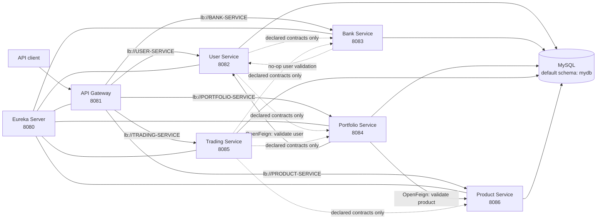

# WealthTrack Microservices

This repository contains the backend microservices for WealthTrack, an investment and wealth-management system. This document describes the code that is currently implemented, how the services relate to one another, and how to configure and run them.

> **Scope:** the standalone services under `EurekaServer`, `APIGateway`, `UserMicroService`, `BankMicroService`, `PortfolioMicroService`, `TradingMicroService`, and `ProductMicroService` are covered here. The `MAIN` folder is intentionally excluded.

## Contents

- [Architecture](#architecture)
- [Service catalog](#service-catalog)
- [Current implementation status](#current-implementation-status)
- [API conventions](#api-conventions)
- [Eureka Server](#eureka-server)
- [API Gateway](#api-gateway)
- [User Microservice](#user-microservice)
- [Bank Microservice](#bank-microservice)
- [Portfolio Microservice](#portfolio-microservice)
- [Trading Microservice](#trading-microservice)
- [Product Microservice](#product-microservice)
- [Service-to-service communication](#service-to-service-communication)
- [Configuration and environment variables](#configuration-and-environment-variables)
- [Setup and running](#setup-and-running)
- [Testing](#testing)
- [Developer notes and known gaps](#developer-notes-and-known-gaps)

## Architecture

The system uses Spring Boot services, Netflix Eureka for discovery, Spring Cloud Gateway for edge routing, synchronous HTTP for the one active service-to-service integration, Spring Data JPA for persistence, and MySQL for runtime data.



The solid Portfolio-to-User and Portfolio-to-Product arrows are implemented runtime calls. Dashed arrows represent Java client interfaces or intended boundaries that are not connected to a real remote client.

### Service ownership

Each service owns its JPA entities and repository layer:

| Service | Owned tables | Cross-service identifiers stored locally |
|---|---|---|
| User | `role`, `user`, `user_detail` | None |
| Bank | `bank_account`, `kyc_document` | `user_id` |
| Portfolio | `portfolio_account`, `portfolio_holding` | `user_id`, `product_id` |
| Trading | `trade_transaction`, `portfolio_statement`, `statement_transaction` | `portfolio_account_id`, `holding_id`, `product_id` |
| Product | `product_type`, `investment_product` | None |

Cross-service IDs are plain scalar values. There are no database foreign keys from one service's entities to another service's entities. The default configuration nevertheless points all five data services at the same `mydb` schema; use different `*_DB_URL` values if physical database-per-service separation is required.

## Service catalog

| Component | Folder | Eureka application name | Default port | Main responsibility |
|---|---|---:|---:|---|
| Eureka Server | `EurekaServer/eurekaserver` | `WTMS-EUREKA-SERVER` | 8080 | Service registry |
| API Gateway | `APIGateway/apigateway` | `WTMS-GATEWAY` | 8081 | Discovery-based routing and circuit-breaker fallbacks |
| User | `UserMicroService/usermicroservice` | `USER-SERVICE` | 8082 | Roles, users, manager hierarchy, risk and KYC profile data |
| Bank | `BankMicroService/bankmicroservice` | `BANK-SERVICE` | 8083 | Linked bank accounts, balances, debit/credit operations, KYC documents |
| Portfolio | `PortfolioMicroService/portfoliomicroservice` | `PORTFOLIO-SERVICE` | 8084 | One investment account per user, holdings, valuations, summaries |
| Trading | `TradingMicroService/tradingmicroservice` | `TRADING-SERVICE` | 8085 | Trade records and generated portfolio statements |
| Product | `ProductMicroService/productmicroservice` | `PRODUCT-SERVICE` | 8086 | Investment product types and product catalog |

All projects target Java 17. The domain services and Eureka use Spring Boot 3.5.4 with Spring Cloud 2025.0.0. The gateway currently uses Spring Boot 4.0.7 with Spring Cloud 2025.1.2.

## Current implementation status

The following distinctions are important when working with the project:

- Eureka registration and discovery configuration exists for every runtime component.
- Portfolio uses real discovery-backed OpenFeign clients to call `USER-SERVICE` and `PRODUCT-SERVICE`.
- Bank's `UserServiceClient` is currently backed by `NoOpUserServiceClient`. User validation is therefore accepted without making a network request when `clients.user.validation-enabled` is absent or `false`.
- User contains Bank and Portfolio client interfaces, but they are not Spring beans and are not used by User business logic.
- Trading contains Bank, Portfolio, and Product client interfaces, but none is implemented, injected, or called by the current transaction service.
- A new trade is only persisted as `PENDING`. It does not debit an account, validate the product or holding, update the portfolio, or advance to `COMPLETED`.
- The gateway route predicates use `/user/**`, `/bank/**`, `/portfolio/**`, `/trading/**`, and `/product/**`, while downstream controllers expose `/api/...`. No `StripPrefix` or `RewritePath` filter is configured. Consequently, direct service URLs work, but the documented gateway prefixes do not currently map cleanly to the controller paths.
- Authentication, authorization, JWT handling, API-level user identity, audit logging, message queues, distributed transactions, and distributed tracing are not implemented.

## API conventions

### Base URLs

During local development, call services directly with:

```text
http://localhost:8082  User
http://localhost:8083  Bank
http://localhost:8084  Portfolio
http://localhost:8085  Trading
http://localhost:8086  Product
```

Dates use ISO-8601 JSON representations:

- `LocalDate`: `YYYY-MM-DD`
- `LocalDateTime`: normally `YYYY-MM-DDTHH:mm:ss`
- Decimal monetary and quantity fields are JSON numbers.

Unless stated otherwise:

- create operations return `201 Created`;
- reads and updates return `200 OK`;
- successful deletes or deactivations return `204 No Content`;
- list endpoints return JSON arrays and are not paginated;
- identifiers are generated numeric values;
- no endpoint currently requires an authentication header.

### Error responses

Error formats are service-specific:

- User, Trading, and Product generally return:

  ```json
  {
    "timestamp": "2026-07-27T20:00:00",
    "status": 400,
    "message": "Reason for the error"
  }
  ```

- Bank returns `timestamp`, `status`, `error`, `message`, `path`, and `fieldErrors`.
- Portfolio returns `timestamp`, `status`, `error`, `message`, `path`, and `validationErrors`.
- Missing resources return `404`. Business-rule and input failures normally return `400`. Bank duplicate/data-integrity failures and Product data-integrity failures return `409`.

## Eureka Server

### Purpose and runtime behavior

`EurekaserverApplication` enables Netflix Eureka Server. It is not a business-data service and has no project-specific REST controller.

- Dashboard: `GET http://localhost:8080/`
- Registry API root used by clients: `http://localhost:8080/eureka/`
- It does not register itself and does not fetch another registry by default.
- Eureka self-preservation is enabled by default.

Start Eureka before the gateway and domain services so registration and discovery are available immediately.

## API Gateway

### Purpose

The gateway uses Spring Cloud Gateway WebFlux, Eureka load-balanced `lb://` destinations, and Resilience4j circuit breakers.

### Configured routes

| Incoming predicate | Destination | Circuit breaker | Fallback |
|---|---|---|---|
| `/user/**` | `lb://USER-SERVICE` | `USER-SERVICE` | `/userFallback` |
| `/bank/**` | `lb://BANK-SERVICE` | `BANK-SERVICE` | `/bankFallback` |
| `/portfolio/**` | `lb://PORTFOLIO-SERVICE` | `PORTFOLIO-SERVICE` | `/portfolioFallback` |
| `/trading/**` | `lb://TRADING-SERVICE` | `TRADING-SERVICE` | `/tradingFallback` |
| `/product/**` | `lb://PRODUCT-SERVICE` | `PRODUCT-SERVICE` | `/productFallback` |

The default time limiter is five seconds. Each fallback returns plain text such as:

```text
User service is taking longer than expected
Please try after sometime
```

### Gateway endpoints

| Method | Path | Response |
|---|---|---|
| GET | `/userFallback` | User fallback text |
| GET | `/bankFallback` | Bank fallback text |
| GET | `/portfolioFallback` | Portfolio fallback text |
| GET | `/tradingFallback` | Trading fallback text |
| GET | `/productFallback` | Product fallback text |

### Routing caveat

Gateway filters forward the original path. For example, `/user/api/users` is forwarded as `/user/api/users`, but User exposes `/api/users`. The gateway needs a path rewrite/strip rule or predicates that match the actual `/api/...` routes before it can be treated as the canonical public API. Until then, use the direct service URLs listed above.

The gateway YAML contains Springdoc paths, but its Maven project does not currently include a Springdoc dependency. Those settings alone do not create an aggregated Swagger UI.

## User Microservice

### Responsibilities and model

The User service owns:

- reusable roles;
- users and their role assignments;
- a self-referencing manager/subordinate hierarchy;
- one optional risk/KYC detail record per user.

`UserResponse` deliberately omits `passwordHash`. The service does **not** hash passwords; callers must provide an already-derived value in the `passwordHash` field.

Relationships inside the service are:

- one Role to many Users;
- one manager User to many subordinate Users;
- one User to at most one UserDetail.

Enums:

- `UserStatus`: `ACTIVE`, `INACTIVE`, `SUSPENDED`
- `RiskLevel`: `LOW`, `MODERATE`, `HIGH`
- `KycStatus`: `PENDING`, `VERIFIED`, `REJECTED`

### Request and response types

`CreateRoleRequest`

| Field | Type | Rules |
|---|---|---|
| `roleName` | string | Required, nonblank, maximum 100 characters |

`RoleResponse`: `roleId`, `roleName`.

`CreateUserRequest`

| Field | Type | Rules |
|---|---|---|
| `roleId` | long | Required and positive; role must exist |
| `managerId` | long | Optional and positive; referenced user must exist |
| `passwordHash` | string | Required and nonblank |
| `email` | string | Required, valid email, unique |
| `fullName` | string | Required and nonblank |
| `phone` | string | Optional |
| `status` | `UserStatus` | Optional; defaults to `ACTIVE` |

`UserResponse`: `userId`, `roleId`, `managerId`, `email`, `fullName`, `phone`, `status`, `createdAt`, `updatedAt`.

`CreateUserDetailRequest`

| Field | Type | Rules |
|---|---|---|
| `userId` | long | Required and positive; user must exist and may have only one detail record |
| `dateOfBirth` | date | Optional |
| `riskLevel` | `RiskLevel` | Optional |
| `riskScore` | integer | Optional; no range validation is currently applied |
| `kycStatus` | `KycStatus` | Optional |

`UserDetailResponse`: `userDetailId`, `userId`, `dateOfBirth`, `riskLevel`, `riskScore`, `kycStatus`.

### Role endpoints

| Method | Path | Request | Response and behavior |
|---|---|---|---|
| POST | `/api/roles` | `CreateRoleRequest` | `201 RoleResponse`; rejects an existing exact role name |
| GET | `/api/roles` | — | All roles |
| GET | `/api/roles/{id}` | — | Role by ID |
| GET | `/api/roles/name/{roleName}` | — | Role by exact repository lookup |
| PUT | `/api/roles/{id}` | `CreateRoleRequest` | Replaces the role name |
| DELETE | `/api/roles/{id}` | — | Hard-deletes the role; blocked while assigned to any user |

### User endpoints

| Method | Path | Request | Response and behavior |
|---|---|---|---|
| POST | `/api/users` | `CreateUserRequest` | `201 UserResponse`; validates role/manager and unique email |
| GET | `/api/users` | — | All users |
| GET | `/api/users/{id}` | — | User by ID |
| GET | `/api/users/email/{email}` | — | User by exact email lookup |
| GET | `/api/users/role/{roleId}` | — | Users assigned to a role |
| GET | `/api/users/manager/{managerId}` | — | Direct subordinates of a manager |
| PUT | `/api/users/{id}` | `CreateUserRequest` | Full update using the same required fields as create |
| DELETE | `/api/users/{id}` | — | Hard-deletes a user; blocked while the user has subordinates |

The persistence entity cascades user-detail operations from User. No business rule currently prevents a user from being set as their own manager or checks for longer management cycles.

### User-detail endpoints

| Method | Path | Request | Response and behavior |
|---|---|---|---|
| POST | `/api/user-details` | `CreateUserDetailRequest` | `201 UserDetailResponse`; only one record per user |
| GET | `/api/user-details` | — | All user details |
| GET | `/api/user-details/{id}` | — | Detail by detail ID |
| GET | `/api/user-details/user/{userId}` | — | Detail by user ID |
| PUT | `/api/user-details/{id}` | `CreateUserDetailRequest` | Full update; can reassign to another user if uniqueness permits |
| DELETE | `/api/user-details/{id}` | — | Hard-deletes the detail |

### Internal logic and integrations

All mutations run in local Spring transactions and reads use read-only transactions. Timestamps are assigned with JPA lifecycle callbacks.

The package contains `BankServiceClient` and `PortfolioServiceClient` contracts for looking up a user's primary bank account and portfolio account. They have no Feign annotations, implementations, or consumers, so the User service currently makes no outbound service calls.

## Bank Microservice

### Responsibilities and model

The Bank service manages external bank-account records and KYC document metadata. It stores the remote User ID rather than a JPA User relationship.

Enums:

- `AccountType`: `SAVINGS`, `CURRENT`, `SALARY`, `NRE`, `NRO`, `OTHER`
- `BankAccountStatus`: `ACTIVE`, `INACTIVE`, `BLOCKED`, `CLOSED`
- `DocumentType`: `PAN`, `AADHAAR`, `PASSPORT`, `DRIVING_LICENSE`, `VOTER_ID`, `OTHER`
- `VerificationStatus`: `PENDING`, `VERIFIED`, `REJECTED`
- KYC record status: `ACTIVE`, `INACTIVE`

Account and document numbers are normalized by removing whitespace and uppercasing. Responses mask them, exposing only the last four characters. The full normalized values remain in the database.

### Request and response types

`CreateBankAccountRequest`

| Field | Type | Rules |
|---|---|---|
| `userId` | long | Required, positive |
| `bankName` | string | Required, maximum 120 |
| `branchName` | string | Optional, maximum 120 |
| `accountNumber` | string | Required, maximum 50, globally unique after normalization |
| `accountType` | string | Required; parsed case-insensitively from `AccountType` |
| `ifscCode` | string | Optional; must match four letters, `0`, then six alphanumeric characters |
| `openingBalance` | decimal | Optional, at least 0; defaults to 0 |
| `primaryAccount` | boolean | Optional; first account is always made primary |

`UpdateBankAccountRequest`: optional `bankName`, `branchName`, `accountType`, `ifscCode`, and `status`. It does not permit account number, user, balance, or primary status changes.

`BankAccountResponse`: `bankAccountId`, `userId`, `bankName`, `branchName`, `maskedAccountNumber`, `accountType`, `ifscCode`, `balance`, `primaryAccount`, `status`, `createdAt`, `updatedAt`.

`DebitRequest` and `CreditRequest`: required `amount` of at least `0.01` and nonblank `transactionReference`.

- `DebitResult`: `approved`, `reference`, `failureReason`
- `CreditResult`: `successful`, `reference`, `failureReason`

`CreateKycDocumentRequest`

| Field | Type | Rules |
|---|---|---|
| `userId` | long | Required, positive |
| `documentType` | string | Required; parsed case-insensitively |
| `documentNumber` | string | Required, maximum 100 |
| `fileName` | string | Optional, maximum 255; metadata only, no file upload/storage |

`UpdateKycVerificationRequest`: required `verificationStatus`.

`KycDocumentResponse`: `kycDocumentId`, `userId`, `documentType`, `maskedDocumentNumber`, `fileName`, `verificationStatus`, `submittedDate`, `verifiedDate`, `status`, `createdAt`, `updatedAt`.

### Bank-account endpoints

| Method | Path | Request | Response and behavior |
|---|---|---|---|
| POST | `/api/bank-accounts` | `CreateBankAccountRequest` | `201 BankAccountResponse`; creates an `ACTIVE` account |
| GET | `/api/bank-accounts/{id}` | — | Account by ID |
| GET | `/api/bank-accounts` | Query: `userId`, `status`, `primary` | Filtered or complete account list |
| PUT | `/api/bank-accounts/{id}` | `UpdateBankAccountRequest` | Partial update of non-null fields |
| PATCH | `/api/bank-accounts/{id}/primary` | — | Makes an `ACTIVE` account primary and clears the flag on the user's other accounts |
| POST | `/api/bank-accounts/{id}/debit` | `DebitRequest` | Locks row, approves and subtracts balance, or returns a rejected result |
| POST | `/api/bank-accounts/{id}/credit` | `CreditRequest` | Locks row, credits balance unless the account is `CLOSED` |
| DELETE | `/api/bank-accounts/{id}` | — | Soft-closes the account and removes primary status |

Debit and credit business failures are returned as `200 OK` result objects with `approved/successful: false`; they are not HTTP errors. Debit requires `ACTIVE` status and sufficient funds. Credit permits `ACTIVE`, `INACTIVE`, and `BLOCKED`, but not `CLOSED`. Pessimistic row locking protects concurrent balance updates inside a single database.

`transactionReference` is echoed but not persisted. There is no bank transaction ledger or idempotency check.

### KYC endpoints

| Method | Path | Request | Response and behavior |
|---|---|---|---|
| POST | `/api/kyc-documents` | `CreateKycDocumentRequest` | `201 KycDocumentResponse`; starts as `PENDING` and `ACTIVE` |
| GET | `/api/kyc-documents/{id}` | — | Document metadata by ID |
| GET | `/api/kyc-documents` | Query: `userId`, `verificationStatus`, `documentType` | Filtered or complete list |
| PUT | `/api/kyc-documents/{id}/verification` | `UpdateKycVerificationRequest` | Changes verification; sets `verifiedDate` only for `VERIFIED` |
| DELETE | `/api/kyc-documents/{id}` | — | Soft-deactivates the record |

The service-level duplicate test looks for the same active `(user, type, number)`. The database uniqueness constraint covers `(user, type, number)` regardless of active/inactive state, so recreating the exact same document after deactivation can still produce a conflict.

### User validation integration

Both account and KYC creation invoke `UserServiceClient.validateUser`. The active implementation is `NoOpUserServiceClient`, selected when:

```properties
clients.user.validation-enabled=false
```

or when the property is missing. It always returns an existing, active user. Setting the property to `true` disables this no-op bean, but no alternative implementation is currently included, so Bank will fail to start unless another `UserServiceClient` bean is added.

## Portfolio Microservice

### Responsibilities and model

The Portfolio service enforces one portfolio account per user and one holding per `(portfolioAccountId, productId)`.

Enums:

- `AccountStatus`: `ACTIVE`, `SUSPENDED`, `CLOSED`
- `HoldingStatus`: `ACTIVE`, `MATURED`, `CLOSED`

Both request-body enums have case-insensitive JSON creators. Uppercase is safest for query-string enum values.

### Request and response types

`CreatePortfolioAccountRequest`: required `userId`; optional `openedDate`, which defaults to today and cannot be in the future.

`PortfolioAccountResponse`: `portfolioAccountId`, `userId`, `accountStatus`, `openedDate`, `closedDate`, `createdAt`, `updatedAt`.

`UpdatePortfolioStatusRequest`: required `accountStatus`.

`CreateHoldingRequest`

| Field | Type | Rules |
|---|---|---|
| `productId` | long | Required |
| `quantity` | decimal | Required, minimum `0.0001` |
| `averageCost` | decimal | Required, minimum `0.0000` |

`UpdateHoldingRequest`: optional `quantity` at least `0`, `averageCost` at least `0`, and `holdingStatus`.

`PortfolioHoldingResponse`: `holdingId`, `portfolioAccountId`, `productId`, `quantity`, `averageCost`, `marketValue`, `unrealizedGainLoss`, `holdingStatus`, `lastValuedAt`, `createdAt`, `updatedAt`.

`PortfolioSummaryResponse`: `portfolioAccount`, `holdings`, `totalCost`, `marketValue`, `unrealizedGainLoss`.

### Endpoints

| Method | Path | Request | Response and behavior |
|---|---|---|---|
| GET | `/` | — | Plain-text health-style message |
| POST | `/api/portfolios` | `CreatePortfolioAccountRequest` | `201 PortfolioAccountResponse`; validates active User through Feign |
| GET | `/api/portfolios` | — | All portfolio accounts |
| GET | `/api/portfolios/{portfolioAccountId}` | — | Account by ID |
| GET | `/api/portfolios/by-user/{userId}` | — | Account by User ID |
| PATCH | `/api/portfolios/{portfolioAccountId}/status` | `UpdatePortfolioStatusRequest` | Updates status and closed date |
| POST | `/api/portfolios/{portfolioAccountId}/holdings` | `CreateHoldingRequest` | `201 PortfolioHoldingResponse`; validates active Product through Feign |
| GET | `/api/portfolios/{portfolioAccountId}/holdings` | Query: optional `status` | Holdings for the account |
| GET | `/api/portfolios/holdings/{holdingId}` | — | Holding by ID |
| PATCH | `/api/portfolios/holdings/{holdingId}` | `UpdateHoldingRequest` | Partial update and recalculation |
| DELETE | `/api/portfolios/holdings/{holdingId}` | — | Hard-delete only after quantity reaches zero or status is `CLOSED` |
| GET | `/api/portfolios/{portfolioAccountId}/summary` | — | Account, holdings, total cost, market value, unrealized gain/loss |

### Core calculations and rules

- Accounts are created `ACTIVE`.
- An account cannot be set to `CLOSED` while it has a nonzero holding that is not `CLOSED`.
- Adding a holding requires an `ACTIVE` portfolio account and an active Product.
- Repeatedly adding the same product increases the existing holding and calculates weighted average cost:

  ```text
  new average cost =
      (old quantity × old average cost + added quantity × added average cost)
      / total quantity
  ```

- Monetary/quantity calculations use four decimal places and `HALF_UP` rounding.
- A zero quantity automatically changes a holding to `CLOSED`.
- Summary total cost is the sum of `quantity × averageCost`.
- Unrealized gain/loss is `marketValue - totalCost`.

At present, `marketValue` is recalculated as `quantity × averageCost`, not `quantity × current product price`. As a result, ordinary add/update operations normally produce zero unrealized gain/loss. There is no price-refresh workflow.

### Real outbound integrations

Portfolio enables OpenFeign and resolves clients by Eureka service name:

| Client | Request | Acceptance rule |
|---|---|---|
| `USER-SERVICE` | `GET /api/users/{id}` | Response has a User ID and status is absent or `ACTIVE` |
| `PRODUCT-SERVICE` | `GET /api/products/{id}` | Response has a Product ID and status is absent or `ACTIVE` |

A downstream `404` becomes a `400 BusinessRuleException`. Other Feign failures become `400` with “User Service is currently unavailable” or “Product Service is currently unavailable.” No circuit breaker or retry is configured on these Feign calls.

## Trading Microservice

### Responsibilities and model

Trading currently acts as a trade-record and portfolio-statement store. It has:

- `trade_transaction` records;
- `portfolio_statement` records;
- a many-to-many `statement_transaction` join table.

Enums:

- `TransactionType`: `BUY`, `SELL`
- `TransactionStatus`: `PENDING`, `COMPLETED`, `FAILED`, `REVERSED`

Only `PENDING` is assigned by implemented business logic.

### Request and response types

`CreateTradeTransactionRequest`

| Field | Type | Rules |
|---|---|---|
| `portfolioAccountId` | long | Required, positive |
| `holdingId` | long | Required, positive |
| `productId` | long | Required, positive |
| `transactionType` | string | Required; case-insensitive `BUY` or `SELL` |
| `quantity` | decimal | Required, minimum `0.01` |
| `unitPrice` | decimal | Required, minimum `0.01` |
| `transactionDate` | datetime | Optional; defaults to current server time |

`TradeTransactionResponse`: `transactionId`, `portfolioAccountId`, `holdingId`, `productId`, `transactionType`, `quantity`, `unitPrice`, `totalAmount`, `transactionStatus`, `transactionDate`.

`CreatePortfolioStatementRequest`

| Field | Type | Rules |
|---|---|---|
| `portfolioAccountId` | long | Required, positive |
| `holdingId` | long | Required, positive |
| `transactionId` | long | Required, positive and must exist locally |
| `statementStart` | date | Required; cannot be after `statementEnd` |
| `statementEnd` | date | Required |
| `openingValue` | decimal | Required, at least 0 |
| `closingValue` | decimal | Required, at least 0 |
| `transactionIds` | array of longs | Optional additional local transaction IDs |

`PortfolioStatementResponse`: `statementId`, `portfolioAccountId`, `holdingId`, `transactionId`, `statementStart`, `statementEnd`, `openingValue`, `closingValue`, `generatedAt`, `status`, `transactionIds`.

### Trade endpoints

| Method | Path | Request | Response and behavior |
|---|---|---|---|
| POST | `/api/trade-transactions` | `CreateTradeTransactionRequest` | `201`; computes `totalAmount = quantity × unitPrice`, status `PENDING` |
| GET | `/api/trade-transactions/{id}` | — | Trade by ID |
| GET | `/api/trade-transactions` | Query: `portfolioAccountId`, `status`, `type`, `startDate`, `endDate` | In-memory filtered list; inclusive date bounds |

If both datetime bounds are provided, `startDate` must not be after `endDate`. Status and type query comparisons are case-insensitive, but unsupported values simply return no matching records rather than a validation error.

### Statement endpoints

| Method | Path | Request | Response and behavior |
|---|---|---|---|
| POST | `/api/portfolio-statements/internal` | `CreatePortfolioStatementRequest` | `201`; links transactions and sets status `GENERATED` |
| GET | `/api/portfolio-statements/{id}` | — | Statement by ID |
| GET | `/api/portfolio-statements` | Query: `portfolioAccountId`, `status`, `startDate`, `endDate` | In-memory filtered list |

Statement values are supplied by the caller; the service does not derive opening/closing values from holdings or transactions. The primary `transactionId` and all additional IDs must exist in Trading. A linked transaction ID is de-duplicated before persistence.

### Declared but inactive integrations

Trading declares these interfaces:

- `BankServiceClient.authorizeDebit`
- `ProductServiceClient.getActiveProduct`
- `PortfolioServiceClient.applyCompletedTrade`

They have no Spring/Feign annotations or implementations and are not injected into `TradeTransactionService`. Therefore, current trade creation does not:

- confirm that the portfolio account, holding, or product exists;
- verify product price or active state;
- distinguish BUY funding from SELL quantity availability;
- debit or credit a bank account;
- modify a Portfolio holding;
- generate a statement automatically;
- provide a status-transition or reversal endpoint.

All IDs in a trade are accepted as caller-supplied references after basic positive-number validation.

## Product Microservice

### Responsibilities and model

The Product service owns the investment catalog:

- `product_type`: a reusable category identified by a normalized code;
- `investment_product`: pricing, minimum investment, risk, valuation method, tenure, rate, dates, and status.

Relationship: one ProductType to many InvestmentProducts.

Enums:

- `ProductStatus`: `ACTIVE`, `INACTIVE`
- `RiskCategory`: `LOW`, `MODERATE`, `HIGH`
- `PriceMethod`: `MARKET`, `NAV`, `FIXED`

### Request and response types

`CreateProductTypeRequest`

| Field | Type | Rules |
|---|---|---|
| `typeCode` | string | Required, maximum 255, unique case-insensitively |
| `typeName` | string | Required, maximum 255 |
| `description` | string | Optional, maximum 255 |
| `status` | `ProductStatus` | Optional; defaults to `ACTIVE` |

Codes are trimmed, uppercased, and have spaces changed to underscores.

`ProductTypeResponse`: `productTypeId`, `typeCode`, `typeName`, `description`, `status`, `createdAt`, `updatedAt`.

`CreateInvestmentProductRequest`

| Field | Type | Rules |
|---|---|---|
| `productTypeId` | long | Required, positive; type must exist |
| `productName` | string | Required, maximum 255, unique case-insensitively |
| `basePrice` | decimal | Required, minimum `0.01` |
| `currentPrice` | decimal | Required, minimum `0.01` |
| `minimumInvestment` | decimal | Required, minimum `0.01` |
| `riskCategory` | `RiskCategory` | Required |
| `priceMethod` | `PriceMethod` | Required |
| `tenureMonths` | integer | Optional and positive |
| `interestRate` | decimal | Optional, minimum `0.0` |
| `issueDate` | date | Optional |
| `maturityDate` | date | Optional; cannot precede issue date |
| `status` | `ProductStatus` | Optional; defaults to `ACTIVE` |

`InvestmentProductResponse`: `productId`, `productTypeId`, `productTypeCode`, `productName`, `basePrice`, `currentPrice`, `minimumInvestment`, `riskCategory`, `priceMethod`, `tenureMonths`, `interestRate`, `issueDate`, `maturityDate`, `status`, `active`, `createdAt`, `updatedAt`.

The `active` boolean mirrors whether `status` is `ACTIVE` and provides a convenient service-client field.

### Product-type endpoints

| Method | Path | Request | Response and behavior |
|---|---|---|---|
| POST | `/api/product-types` | `CreateProductTypeRequest` | `201 ProductTypeResponse` |
| GET | `/api/product-types/{id}` | — | Type by ID |
| GET | `/api/product-types` | Query: optional `status`, `typeName` | In-memory filtered list |
| PUT | `/api/product-types/{id}` | `CreateProductTypeRequest` | Full update |
| DELETE | `/api/product-types/{id}` | — | Hard-delete; blocked while products use the type |

### Investment-product endpoints

| Method | Path | Request | Response and behavior |
|---|---|---|---|
| POST | `/api/products` | `CreateInvestmentProductRequest` | `201 InvestmentProductResponse` |
| GET | `/api/products/{id}` | — | Product by ID; used by Portfolio Feign validation |
| GET | `/api/products` | Query: `productTypeId`, `status`, `riskCategory`, `priceMethod`, `productName` | In-memory filtered list |
| PUT | `/api/products/{id}` | `CreateInvestmentProductRequest` | Full update |
| DELETE | `/api/products/{id}` | — | Hard-delete |

The service has no outbound calls. Deactivation is performed with a full `PUT` setting `status` to `INACTIVE`; there is no dedicated price or status patch endpoint.

## Service-to-service communication

### Communication matrix

| Caller | Callee | Mechanism | Current state |
|---|---|---|---|
| Gateway | All domain services | Eureka load-balanced Gateway route | Configured, but route/controller path mismatch requires correction |
| Portfolio | User | OpenFeign + Eureka name | Active; validates user before account creation |
| Portfolio | Product | OpenFeign + Eureka name | Active; validates product before adding a holding |
| Bank | User | `UserServiceClient` boundary | No-op implementation; no HTTP call |
| User | Bank | Plain Java interface | Declared only |
| User | Portfolio | Plain Java interface | Declared only |
| Trading | Bank | Plain Java interface | Declared only |
| Trading | Product | Plain Java interface | Declared only |
| Trading | Portfolio | Plain Java interface | Declared only |

### Configuring the active Portfolio calls

For Portfolio discovery calls to work:

1. Start Eureka.
2. Start User with `USER_APPLICATION_NAME=USER-SERVICE`.
3. Start Product with `PRODUCT_APPLICATION_NAME=PRODUCT-SERVICE`.
4. Start Portfolio with registry fetching enabled and the same Eureka URL.
5. Confirm all three appear in the Eureka dashboard.

The service names in the Feign annotations are fixed in code. Changing `USER_APPLICATION_NAME` or `PRODUCT_APPLICATION_NAME` to a different value will break Portfolio discovery unless the annotations/configuration are updated too.

### Consistency model

Every `@Transactional` boundary is local to one service and one database connection. There is no saga, outbox, event stream, two-phase commit, or compensating transaction workflow. No implemented operation atomically changes data in multiple services.

## Configuration and environment variables

### `.env` loading

Every service has:

- a tracked `.env.example` containing non-secret defaults/placeholders;
- an ignored `.env` for local credentials;
- an `application.yaml` that imports `.env` as a Java-properties-style file.

The import list supports common launch locations:

- repository root, for example `UserMicroService/usermicroservice/.env`;
- service parent directory, for example `usermicroservice/.env`;
- service module directory, using `.env`.

Operating-system environment variables and IDE environment settings can also provide the same keys and take precedence over file values.

Never commit real passwords. Each service-level `.gitignore` excludes `.env`.

### Database-service variables

User, Bank, Portfolio, Trading, and Product use the same variable pattern. Replace `{PREFIX}` with `USER`, `BANK`, `PORTFOLIO`, `TRADING`, or `PRODUCT`.

| Variable | Default | Purpose |
|---|---|---|
| `{PREFIX}_SERVER_PORT` | Service-specific 8082–8086 | HTTP port |
| `{PREFIX}_APPLICATION_NAME` | Service-specific Eureka name | Spring application/registration name |
| `{PREFIX}_DB_URL` | `jdbc:mysql://localhost:3306/mydb` | JDBC connection URL |
| `{PREFIX}_DB_DRIVER` | `com.mysql.cj.jdbc.Driver` | JDBC driver |
| `{PREFIX}_DB_USERNAME` | `root` | MySQL username |
| `{PREFIX}_DB_PASSWORD` | Empty | MySQL password |
| `{PREFIX}_JPA_DDL_AUTO` | `update` | Hibernate schema behavior |
| `{PREFIX}_JPA_SHOW_SQL` | `true` | SQL logging |
| `{PREFIX}_EUREKA_REGISTER` | `true` | Register with Eureka |
| `{PREFIX}_EUREKA_FETCH_REGISTRY` | `true` | Fetch service registry |
| `{PREFIX}_EUREKA_URL` | `http://localhost:8080/eureka/` | Registry URL |
| `{PREFIX}_EUREKA_HOSTNAME` | `localhost` | Advertised instance hostname |

Bank also recognizes the Spring property `clients.user.validation-enabled`. It is not currently represented by a `BANK_*` placeholder. Leave it absent/false to use the no-op validator.

### Eureka variables

| Variable | Default |
|---|---|
| `EUREKA_SERVER_PORT` | `8080` |
| `EUREKA_APPLICATION_NAME` | `WTMS-EUREKA-SERVER` |
| `EUREKA_REGISTER` | `false` |
| `EUREKA_FETCH_REGISTRY` | `false` |
| `EUREKA_URL` | `http://localhost:8080/eureka/` |
| `EUREKA_SELF_PRESERVATION` | `true` |

### Gateway variables

| Variable | Default |
|---|---|
| `GATEWAY_SERVER_PORT` | `8081` |
| `GATEWAY_APPLICATION_NAME` | `WTMS-GATEWAY` |
| `GATEWAY_TIMEOUT_DURATION` | `5s` |
| `GATEWAY_EUREKA_REGISTER` | `true` |
| `GATEWAY_EUREKA_FETCH_REGISTRY` | `true` |
| `GATEWAY_EUREKA_URL` | `http://localhost:8080/eureka/` |
| `GATEWAY_EUREKA_HOSTNAME` | `localhost` |
| `GATEWAY_SWAGGER_UI_PATH` | `/swagger-ui.html` |
| `GATEWAY_API_DOCS_PATH` | `/v3/api-docs` |

### Diagnosing `using password: NO`

This MySQL message means Spring reached MySQL without sending a password:

```text
Access denied for user 'root'@'localhost' (using password: NO)
```

Check the microservice-specific variable, not a generic `DB_PASSWORD`. For User, for example:

```properties
USER_DB_USERNAME=root
USER_DB_PASSWORD=your_actual_password
```

Then verify that the `.env` is inside `UserMicroService/usermicroservice`, that the current working directory matches one of the supported import locations, and that the service was restarted after the change. `using password: YES` with an access-denied error instead means a password was supplied but MySQL rejected the credentials or host permissions.

## Setup and running

### Prerequisites

- JDK 17
- MySQL 8 or compatible MySQL server
- Maven 3.9.x
- PowerShell/Windows for the commands below, or translate them to the equivalent shell commands
- Free local ports 8080 through 8086

Each service is an independent Maven project. There is no non-`MAIN` root Maven aggregator. Maven wrapper scripts are present, but the checked-in Windows `mvnw.cmd` scripts currently fail on this workspace with `Cannot index into a null array`; the commands below therefore use an installed Maven executable.

### 1. Create the database

The default configuration expects:

```sql
CREATE DATABASE mydb;
```

Grant the configured users access to the selected schemas. For stronger service isolation, create one schema per data service and set each service's `*_DB_URL` accordingly.

Hibernate uses `ddl-auto=update` by default and creates/updates mapped tables on startup. Portfolio contains SQL copies of a `V1__create_portfolio_tables.sql` script, but Flyway is not a declared dependency and the files are not currently the active schema-management mechanism.

### 2. Create local environment files

From the repository root:

```powershell
$services = @(
  "EurekaServer/eurekaserver",
  "APIGateway/apigateway",
  "UserMicroService/usermicroservice",
  "BankMicroService/bankmicroservice",
  "PortfolioMicroService/portfoliomicroservice",
  "TradingMicroService/tradingmicroservice",
  "ProductMicroService/productmicroservice"
)

foreach ($service in $services) {
  Copy-Item "$service/.env.example" "$service/.env"
}
```

Edit the five database-service `.env` files and replace `replace_with_your_mysql_password`. Adjust JDBC URLs, users, ports, or Eureka URLs as necessary.

### 3. Start the services

Use a separate terminal for each process. Recommended order:

1. Eureka
2. User and Product
3. Bank, Portfolio, and Trading
4. Gateway

Commands from the repository root:

```powershell
mvn -f .\EurekaServer\eurekaserver\pom.xml spring-boot:run
mvn -f .\UserMicroService\usermicroservice\pom.xml spring-boot:run
mvn -f .\ProductMicroService\productmicroservice\pom.xml spring-boot:run
mvn -f .\BankMicroService\bankmicroservice\pom.xml spring-boot:run
mvn -f .\PortfolioMicroService\portfoliomicroservice\pom.xml spring-boot:run
mvn -f .\TradingMicroService\tradingmicroservice\pom.xml spring-boot:run
mvn -f .\APIGateway\apigateway\pom.xml spring-boot:run
```

You can alternatively `Set-Location` into a module and run `mvn spring-boot:run`. On platforms where the wrapper script works, `./mvnw spring-boot:run` remains an option.

### 4. Verify startup

1. Open `http://localhost:8080/` and confirm registered service names.
2. Call Portfolio's simple root endpoint: `GET http://localhost:8084/`.
3. Open a domain service's Springdoc UI, normally:

   ```text
   http://localhost:8082/swagger-ui.html
   http://localhost:8083/swagger-ui.html
   http://localhost:8084/swagger-ui.html
   http://localhost:8085/swagger-ui.html
   http://localhost:8086/swagger-ui.html
   ```

4. For Portfolio operations, ensure User and Product are registered before creating accounts or holdings.

### Suggested data creation order

For a basic working dataset:

1. Create a User role.
2. Create a User referencing that role.
3. Optionally create the User's risk/KYC detail.
4. Create a Product type.
5. Create an active Product referencing that type.
6. Create a Portfolio account for the active User.
7. Add a holding for the active Product.
8. Create Bank account/KYC records if needed; current Bank user validation is bypassed.
9. Create Trading records only with IDs already known to the caller; Trading does not validate them remotely.

## Testing

Run tests independently from each service module:

```powershell
mvn test
```

Implemented test coverage includes:

- context-load tests for all seven components;
- Bank controller and service tests for create, primary-account selection, debit behavior, and KYC verification;
- Portfolio controller and service tests for account creation, duplicate rejection, and holding creation;
- Trading API/service tests for trade calculation, type validation, date-range validation, and statement linkage;
- Product JPA repository CRUD and query tests.

User currently has only a context-load test. There is no root test command that aggregates all non-`MAIN` services. Context-load tests for MySQL-backed services may require usable test/runtime datasource configuration unless their test setup replaces it.

## Developer notes and known gaps

### Persistence and data lifecycle

- JPA uses `ddl-auto=update`; there is no active, uniform migration framework.
- User roles, users, user details, Product types/products, Portfolio holdings, trades, and statements use hard deletion where a delete API exists, except Bank account closure and KYC deactivation, which are soft state changes.
- Most collection filtering is performed in Java after `findAll` or a broad repository query. There is no pagination, sorting contract, or database-level combined search specification.
- Timestamps use each service host's local clock. No explicit UTC policy is configured.
- Enum representation is not fully uniform: some entities store typed JPA enums, while User, Trading, and Product store several enum values as strings.

### Financial and security limitations

- This is not yet a production banking ledger. Bank balances are mutable account columns; there is no immutable journal, double-entry accounting, settlement record, reconciliation, or persisted debit idempotency key.
- Trading is record creation, not trade execution or settlement.
- Portfolio valuation currently uses average cost as the valuation price.
- No API authentication or authorization protects financial or personal data.
- User accepts a `passwordHash` but does not derive, verify, salt, or authenticate it.
- Bank masks account and document numbers in API responses, but values are not application-encrypted at rest.
- KYC stores file names only; it does not upload, scan, encrypt, or retain document files.

### Integration work needed for a complete workflow

1. Align gateway paths with downstream `/api/...` paths and add a deliberate public route contract.
2. Replace Bank's no-op User validator with a real discovery-backed client.
3. Implement Trading orchestration with explicit validation, funding, holding updates, status transitions, idempotency, and compensation.
4. Decide whether User's outbound account-summary interfaces are needed and implement or remove them.
5. Add resilience policies to Portfolio Feign calls and use appropriate downstream-unavailable HTTP status mapping.
6. Introduce service-specific databases, migrations, audit/security controls, and observability before production use.

This README documents current code behavior. Proposed integrations in interface comments are not treated as already implemented features.
